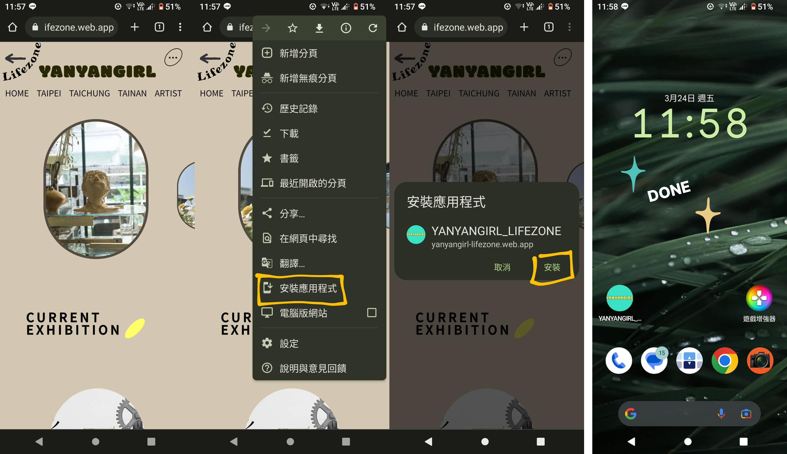
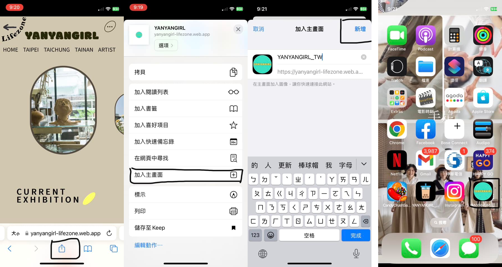

# ✨✨YANYANGIRL LIFEZONE ✨✨

  

```
This lovely website is about exhibitions (fine art / scuplture / illustraction / craft). Provide some information about current or upcoming exhibitions, and some exhibition record.

```

## ✨Built with✨

- Webpack 5
- React
- Firebase v9
- Scss

## ✨Feature✨

### Create the custom exit animations for Modal & Menu.


- Do not rely on 3rd party library.
- Use hooks (useRef/useState) to store content and toggle state.
- Before component exit (click event), use setTimeout() methods to trigger exit animation.

```cpp

  const modalContainerRef = useRef();
  const modalRef = useRef();
  function modalMoveOut() {
    modalRef.current.style =
      "animation:modalMoveOut 0.2s ease-in-out forwards;transform-origin:  bottom left ;";
    modalContainerRef.current.style = "opacity:0;";
  }

 // modalContainerRef//
  onClick={() => {
        modalMoveOut();
        setTimeout(() => {
          changeContent();
        }, 200);
      }}
```

### 👉👉PWA


👉 Use **service workers**, **manifests**, and other features in combination with progressive enhancement to give users an experience on par with native apps.

#### 🔶Install PWA

- Laptop/Desktop

  1. After open Chrome, go to a website you want to install.
  2. At the top right of the address bar, click Install .
  3. Follow the onscreen instructions to install the PWA.

- Android

  

* IOS

  

### 👉👉 SEO and Accessibility friendly


- UX tools

  - Color Blind+ (Figma Plugin)
    - View my designs in the 8 different types of color vision deficiencies.

  * A11y - Color Contrast Checker (Figma Plugin)
    - Check the color contrast ratio of all visible text in a frame.
  * Google Lighthouse (Chrome DevTools)

    - Custom controls have ARIA roles and ARIA labels.

    - Button, link, and menuitem elements have accessible names.

  - [SEO Audits](https://developer.chrome.com/docs/lighthouse/seo/ "游標顯示") / [Accessibility Audits](https://developer.chrome.com/docs/lighthouse/accessibility/ "游標顯示")
